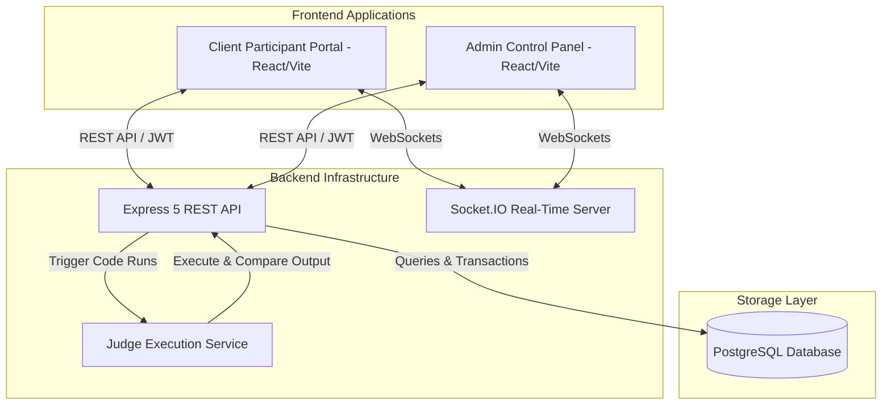

# DebugLab 🚀

> **An Open-Source Real-Time Competitive Programming, Code Debugging & Contest Management Platform.**

[](https://opensource.org/licenses/MIT)
[](https://nodejs.org/)
[](https://react.dev/)
[](https://vitejs.dev/)
[](https://expressjs.com/)
[](https://www.postgresql.org/)

DebugLab is an end-to-end, high-performance platform designed for hosting debugging challenges, algorithmic competitive programming contests, and fast-paced buzzer events. It features an integrated Monaco code editor, multi-language automated code judge execution, real-time Socket.IO timer and leaderboard updates, and granular admin controls.

---

## 🛠 Features

### 💻 Participant Portal (`/client`)
- **Monaco Code Editor**: Rich in-browser IDE with offline capabilities, syntax highlighting, line numbers, auto-closing brackets, and multi-language support (C, C++, Python, Java, JavaScript).
- **Real-Time Synchronized Timer**: Server-authoritative wall-clock timer synchronization via WebSockets (Socket.IO) ensuring zero timer drift across participants.
- **Interactive Leaderboard**: Instant leaderboard updates on submission results with score tracking, penalty calculations, and contest ranking.
- **Segmented Domain Access**: Isolated authentication and contest routing for **Debug** and **Buzzer** contest participants.

### 🛡 Admin Dashboard (`/admin`)
- **Live Contest Duration Control**: Dynamic real-time duration modifications (add extra minutes or reduce duration on-the-fly) without interrupting ongoing contests.
- **Problem & Test Case Management**: Intuitive dashboard to create, update, and manage problem statements, sample test cases, hidden test cases, and memory/time constraints.
- **User & Participant Domain Segmentation**: Dedicated management for `debug_users`, `buzzer_users`, and administrative staff. Bulk user import tools included.
- **Complaint & Dispute Resolution System**: In-platform ticketing system for handling participant queries and complaint status updates.

### ⚙ Backend & Judge Sandbox (`/server`)
- **Multi-Language Judge Engine**: Automated compilation and test case execution for C, C++, Python, Java, and JavaScript.
- **Security & Execution Isolation**: Safe process spawn timeouts, output truncations, and resource constraints to handle user code execution safely.
- **PostgreSQL Relational Storage**: Optimized schema for high-concurrency submission logging, leaderboard recalculations, and contest tracking.
- **Robust Auth & Security**: JWT-based session security, password hashing with bcrypt, Helmet headers, CORS policies, and rate-limiting middleware.

---

## 🏗 Architecture Overview



---

## 📁 Repository Structure

```
debuglab/
├── client/              # Participant frontend application (React + Vite + Monaco)
│   ├── src/             # Components, pages, context providers, Monaco setup
│   ├── .env.example     # Client environment variable template
│   └── package.json
├── admin/               # Administrative dashboard (React + Vite + Lucide)
│   ├── src/             # Admin controllers, contest controls, user managers
│   ├── .env.example     # Admin environment variable template
│   └── package.json
├── server/              # Express backend server & execution judge
│   ├── src/
│   │   ├── config/      # System configurations
│   │   ├── controllers/ # REST API route controllers
│   │   ├── db/          # PostgreSQL database initialization & schema SQL
│   │   ├── middleware/  # JWT auth, CORS, rate limiters
│   │   ├── routes/      # Express routes (auth, contests, problems, submissions)
│   │   ├── services/    # Code judge runner & language execution engines
│   │   └── index.js     # Entry point & Socket.IO server initialization
│   ├── .env.example     # Server environment variable template
│   └── package.json
├── package.json         # Root workspace scripts (runs client, admin, server concurrently)
├── CONTRIBUTING.md      # Open-source contribution guidelines
└── LICENSE              # MIT License
```

---

## 🚀 Quick Start Guide

### Prerequisites
Make sure you have the following installed on your local development machine:
- **Node.js**: `v18.0.0` or higher
- **npm**: `v9.0.0` or higher
- **PostgreSQL**: `v14` or higher
- **Compilers / Runtimes** (for local code judge testing): `gcc`, `g++`, `python3`, `openjdk-17-jdk`, `node`

### 1. Clone the Repository
```bash
git clone https://github.com/mas173/DebugLab.git
cd debuglab
```

### 2. Install Dependencies
Install dependencies for all workspace modules at once using root script:
```bash
# Install root workspace dependencies
npm install

# Install dependencies for client, admin, and server
cd client && npm install && cd ..
cd admin && npm install && cd ..
cd server && npm install && cd ..
```

### 3. Environment Variables Setup
Copy `.env.example` files to `.env` across all workspace folders:

#### Backend Server (`server/.env`)
```bash
cp server/.env.example server/.env
```
Edit `server/.env`:
```env
PORT=5000
NODE_ENV=development

DB_HOST=localhost
DB_PORT=5432
DB_USER=postgres
DB_PASSWORD=your_postgres_password
DB_NAME=debuglab

JWT_SECRET=your_super_secret_jwt_key
JWT_EXPIRES_IN=30d

CLIENT_ORIGIN=http://localhost:5173
ADMIN_ORIGIN=http://localhost:5174

ADMIN_USERNAME=admin
ADMIN_PASSWORD=admin123
```

#### Client Portal (`client/.env`)
```bash
cp client/.env.example client/.env
```
```env
VITE_API_URL=http://localhost:5000
```

#### Admin Dashboard (`admin/.env`)
```bash
cp admin/.env.example admin/.env
```
```env
VITE_API_URL=http://localhost:5000
```

### 4. Database Setup & Initialization
Create the database in PostgreSQL and initialize the schema:
```bash
# Log into PostgreSQL CLI or pgAdmin and create the database:
createdb -U postgres debuglab

# Initialize database schema and admin seed user
cd server
npm run start # Will run dbInit automatically on initial server startup
```

### 5. Running the Application
From the repository root directory, run all services concurrently:
```bash
npm run dev
```

This starts:
- 🟢 **Server**: `http://localhost:5000`
- 🔵 **Client Portal**: `http://localhost:5173`
- 🟡 **Admin Dashboard**: `http://localhost:5174`

---

## 📡 API Overview

| Endpoint | Method | Description | Auth Required |
|---|---|---|---|
| `/api/auth/login` | `POST` | Authenticate user (admin / debug / buzzer domain) | No |
| `/api/contests` | `GET` | List active & upcoming contests | Yes |
| `/api/contests/:id` | `GET` | Retrieve contest details | Yes |
| `/api/contests/:id/time` | `PUT` | Add or reduce contest duration in real-time | Admin |
| `/api/problems` | `GET` | Retrieve problem set for a contest | Yes |
| `/api/submissions` | `POST` | Submit solution for execution & scoring | Yes |
| `/api/leaderboard/:contestId` | `GET` | Fetch current leaderboard standings | Yes |
| `/api/monitoring/health` | `GET` | System health check & metrics | Admin |

---

## 🤝 Contributing

We welcome open-source contributions from developers of all skill levels! Whether you are fixing bugs, improving documentation, adding new feature support, or optimizing code execution performance.

Please read our [**CONTRIBUTING.md**](./CONTRIBUTING.md) guide for detailed instructions on branch naming conventions, development setup, code quality standards, and pull request workflows.

---

## 📄 License

DebugLab is open-source software licensed under the **[MIT License](./LICENSE)**. Feel free to use, modify, and distribute it.

---

<p center align="center">Made with ❤️ for competitive programmers and contest organizers worldwide.</p>
